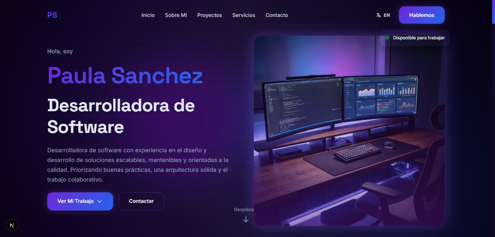

# Portafolio de Desarrolladora - V2

Bienvenido a mi portafolio, un sitio web creado para mostrar mis habilidades, proyectos y experiencias como desarrolladora de software. Este portafolio ha sido desarrollado con Next.js 15, React 19, TypeScript y Tailwind CSS, y está diseñado para ofrecer una experiencia de usuario intuitiva, atractiva y bilingüe.

## Tecnologías Utilizadas

- **Next.js 15**: Framework principal para el desarrollo de la aplicación con App Router.
- **React 19**: Biblioteca de JavaScript para construir interfaces de usuario.
- **TypeScript**: Tipado estático para mayor robustez y mantenibilidad del código.
- **Tailwind CSS**: Framework de utilidades CSS para un diseño moderno y responsive.
- **Framer Motion**: Biblioteca de animaciones para transiciones fluidas y efectos visuales.

## Características Clave

- **Diseño Responsive**: Adaptación completa a diferentes tamaños de pantalla para una experiencia óptima en dispositivos móviles y de escritorio.
- **Bilingüe**: Soporte completo para español e inglés con cambio de idioma dinámico y persistencia en localStorage.
- **Animaciones Suaves**: Transiciones y efectos visuales modernos utilizando Framer Motion.
- **Modo Oscuro**: Diseño optimizado con tema oscuro profesional y colores vibrantes.
- **Navegación Intuitiva**: Menú responsive con scroll suave entre secciones.

## Configuración

Sigue estos pasos para configurar y ejecutar la aplicación en tu máquina local:

1. Clona este repositorio en tu máquina local.

```bash
git clone https://github.com/PauSanchezzz/portfolio-v2.git
```

2. Accede al directorio del proyecto.

```bash
cd portfolio-v2
```

3. Instala las dependencias.

```bash
npm install
```

4. Inicia la aplicación en modo desarrollo.

```bash
npm run dev
```

5. Abre [http://localhost:3000](http://localhost:3000) en tu navegador para ver el resultado.

## Scripts Disponibles

- `npm run dev` - Inicia el servidor de desarrollo
- `npm run build` - Construye la aplicación para producción
- `npm start` - Inicia el servidor de producción
- `npm run lint` - Ejecuta el linter para verificar el código

## Vista Previa


